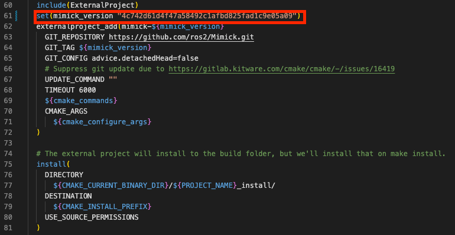
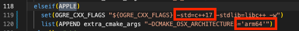
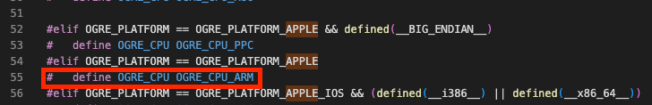
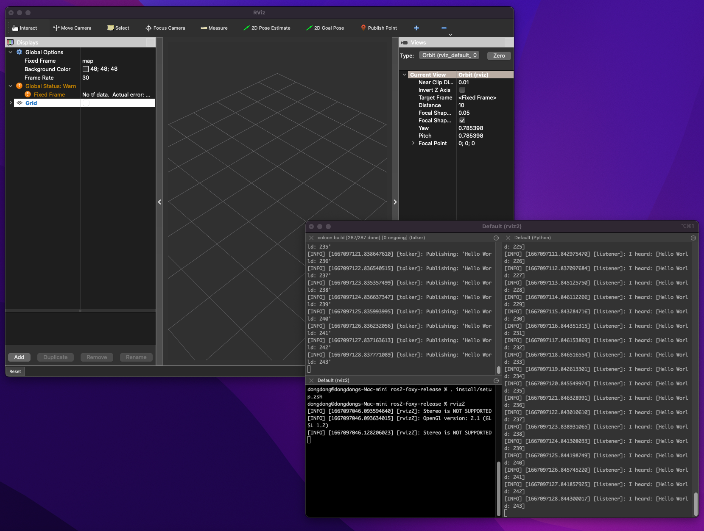

# Install ros2 foxy natively on MacOS without docker / virtual machine

This is a tutorial to explain how to compile ros2 on MacOS. Here we will use `foxy` version as an example and it should work with other version with minor revison.

Environment: 

MacOS Version  | MacOS Monterey v12.5.1
------------- | -------------
CPU				  | Apple M1
Memory  | 16GB
ROS | ROS2 Foxy


## Install dependencies

**Official dependencies**

The official dependencies can be found [here](). You can copy the script below and make it executable. Then run it in a shell script.

```

/bin/bash -c "$(curl -fsSL https://raw.githubusercontent.com/Homebrew/install/HEAD/install.sh)"

echo '# Set PATH, MANPATH, etc., for Homebrew.' >> /Users/dongdong/.zprofile

echo 'eval "$(/opt/homebrew/bin/brew shellenv)"' >> /Users/dongdong/.zprofile

eval "$(/opt/homebrew/bin/brew shellenv)"

brew install python3

# install asio and tinyxml2 for Fast-RTPS
brew install asio tinyxml2

# install dependencies for robot state publisher
brew install tinyxml eigen pcre poco

# OpenCV isn't a dependency of ROS 2, but it is used by some demos.
brew install opencv

# install OpenSSL for DDS-Security
brew install openssl

# install Qt for RViz
brew install qt freetype assimp

# install dependencies for rcl_logging_log4cxx
brew install log4cxx

brew install sip pyqt5

ln -s /usr/local/share/sip/Qt5 /usr/local/share/sip/PyQt5

brew install graphviz

python3 -m pip install pydot

python3 -m pip install \
    --global-option=build_ext \
    --global-option="-I$(brew --prefix graphviz)/include/" \
    --global-option="-L$(brew --prefix graphviz)/lib/" \
    pygraphviz


python3 -m pip install lxml

python3 -m pip install catkin_pkg empy lark-parser pyparsing pyyaml setuptools argcomplete

xcode-select --install

brew install cmake cppcheck eigen pcre poco python3 tinyxml wget

# install dependencies for Fast-RTPS if you are using it
brew install asio tinyxml2

brew install opencv

# install console_bridge for rosbag2
brew install console_bridge

# install OpenSSL for DDS-Security
brew install openssl
# if you are using ZSH, then replace '.bashrc' with '.zshrc'
echo "export OPENSSL_ROOT_DIR=$(brew --prefix openssl)" >> ~/.bashrc

# install dependencies for rcl_logging_log4cxx
brew install log4cxx

# install CUnit for Cyclone DDS
brew install cunit

# install dependencies for Rviz
brew install qt freetype assimp

# Add the Qt directory to the PATH and CMAKE_PREFIX_PATH
export CMAKE_PREFIX_PATH=$CMAKE_PREFIX_PATH:/usr/local/opt/qt
export PATH=$PATH:/usr/local/opt/qt/bin

brew install graphviz pyqt5 sip

ln -s /usr/local/share/sip/Qt5 /usr/local/share/sip/PyQt5

python3 -m pip install -U argcomplete catkin_pkg colcon-common-extensions coverage empy flake8 flake8-blind-except flake8-builtins flake8-class-newline flake8-comprehensions flake8-deprecated flake8-docstrings flake8-import-order flake8-quotes lark-parser mock nose pep8 pydocstyle pydot pygraphviz pyparsing setuptools vcstool


python3 -m pip install pytest

python3 -m pip install em

python3 -m pip install netifaces

# install bullet

/bin/bash -c "$(curl -fsSL https://raw.githubusercontent.com/Homebrew/install/HEAD/install.sh)"

echo 'eval "$(/opt/homebrew/bin/brew shellenv)"' >> ~/.zprofile

brew install bullet

# for buillet, refer to https://macappstore.org/bullet/

```

**Homebrew page about qt5**

The system should come with qt5 or qt6. It is not necessary for you to install here. In case your system doesn't have this dependency, you can refer [here](https://formulae.brew.sh/formula/qt)
`brew install qt`

***

##Bash profile

Assume you need to use `homebrew` to install dependencies here. You can change the directory to other path which contains `Python` and its lib.

Use `which python3` to check the directory of Python. Ensure all the dependencies are installed to the same Python path if there are multiple python versions in the same environment.

Need to indicate the path `qt5` and be careful here it is NOT the path of `qt@5`. If you have Qt6 installed, please use `brew uninstall qt` to uninstall the new version if there is any other error while compiling.

```
export CMAKE_PREFIX_PATH=/opt/homebrew/opt/qt5

export PYTHONPATH=/opt/homebrew/lib/python3.10/site-packages:$PYTHONPATH
export CMAKE_PREFIX_PATH=/opt/homebrew:$CMAKE_PREFIX_PATH
export LD_LIBRARY_PATH=/opt/homebrew/lib:$LD_LIBRARY_PATH

source ~/Downloads/ros2_foxy/install/local_setup.bash
```

After adding these contents to bash file, source the bash file:

`source ~/.bash_profile`

## Deploy repos
download the `foxy-release` branch in the offical github and download the fils to the `src` folder

```
cd
git clone -b foxy-release https://github.com/ros2/ros2.git
cd ros2-foxy
mkdir src
vcs import src < ros2.repos
```

## Compile


**change the hash key**

Open the file `src/ros2/mimick_vendor/CMakeLists.txt` and replace the hash key with `4c742d61d4f47a58492c1afbd825fad1c9e05a09`.



***

**replace the `backward-cpp`**

this is caused by the failure of `osrf_testing_tools_cpp`

Open the folder `src/osrf/osrf_testing_tools_cpp/osrf_testing_tools_cpp/src/memory_tools/vendor/bombela` and find the folder `backward-cpp`.

```
cd src/osrf/osrf_testing_tools_cpp/osrf_testing_tools_cpp/src/memory_tools/vendor/bombela
rm -rf backward-cpp
git clone https://github.com/bombela/backward-cpp.git
```

for more details, please refer to this [dicussion](https://github.com/osrf/osrf_testing_tools_cpp/pull/64).

***

**patch `rviz_ogre_vendor`error1**

On the failure to build `rviz_ogre_vendor`
```
Undefined symbols for architecture x86_64:
  "_FT_Done_FreeType", referenced from:
      Ogre::Font::loadResource(Ogre::Resource*) in OgreFont.cpp.o
  "_FT_Init_FreeType", referenced from:
      Ogre::Font::loadResource(Ogre::Resource*) in OgreFont.cpp.o
  "_FT_Load_Char", referenced from:
      Ogre::Font::loadResource(Ogre::Resource*) in OgreFont.cpp.o
  "_FT_New_Memory_Face", referenced from:
      Ogre::Font::loadResource(Ogre::Resource*) in OgreFont.cpp.o
  "_FT_Set_Char_Size", referenced from:
      Ogre::Font::loadResource(Ogre::Resource*) in OgreFont.cpp.o
ld: symbol(s) not found for architecture x86_64
```

patch the file `src/ros2/rviz/rviz_ogre_vendor/CMakeLists.txt`

change the compiler to `c++17` and architecture to `arm64`



***

**patch `rviz_ogre_vendor` error2**

On the failure to build `rviz_ogre_vendor`

```
error: use of undeclared identifier '__builtin_ia32_emms'; did you mean '__builtin_isless'?
```

update `build/rviz_ogre_vendor/ogre-v1.12.1-prefix/src/ogre-v1.12.1/OgreMain/include/OgrePlatformInformation.h`(which is downloaded after the build, you need to build `rviz_ogre_vendor` at least once), see blog dicussion [here](http://mamykin.com/posts/building-ros2-on-macos-big-sur-m1/)

change the cpu type to `OGRE_CPU_ARM`



***

**patch `rcl_logging`**

Opend the file `src/ros2/rcl_logging/rcl_logging_log4cxx/CMakeLists.txt`

change the `CMAKE_CXX_STANDARD` to 17

***

**patch `rcpputils`**

Open the file `src/ros2/rcpputils/CMakeLists.txt`

change the `CMAKE_CXX_STANDARD` to 17

add the compiler option `add_compile_options(-Wall -Wextra -Wpedantic -Wno-deprecated-copy)`

***

**patch `rcutils`**

Open the file `src/ros2/rcutils/CMakeLists.txt`

add the compiler option `add_compile_options(-Wall -Wextra -Wconversion -Wno-sign-conversion -Wpedantic -Wno-deprecated-copy)`

***

**patch `rosbag2_transport`**

Open the file `src/ros2/rosbag2/rosbag2_storage/CMakeLists.txt`

add the compiler option `-Wno-deprecated-copy`

***

**patch `rosbag2_storage_default_plugins`**

add the compiler option `-Wno-deprecated-copy`

**patch similar packages**


path  | patch
------------- | -------------
`src/ros2/rosbag2/rosbag2_storage/CMakeLists.txt` | add the compiler option `-Wno-deprecated-copy`
`src/ros2/rosbag2/rosbag2_cpp/CMakeLists.txt`  | add the compiler option `-Wno-deprecated-copy`
`src/ros2/rosbag2/rosbag2_tests/CMakeLists.txt` | add the compiler option `-Wno-deprecated-copy`


possibly not listed all the packages for this error, proceed to use above approach to solve it.

```
error: definition of implicit copy constructor for 'FunctionRef<void (int, int, int)>' is deprecated because it has a user-declared copy assignment operator [-Wdeprecated-copy]
```

***

`cd ~/ros2_foxy/`
`arch -arm64 colcon build --symlink-install --packages-skip-by-dep python_qt_binding`

***

**possible errors**

As the compiling is not supported offically, there may exist error besides the work we described here.

If there is some error which is fixed by CMakeList.txt, the change may not affect the compiling due to the cache.

You might want to add the arguments to the compiling cmd:

`arch -arm64 colcon build --symlink-install --packages-skip-by-dep python_qt_binding --cmake-clean-cache`

or simply remove the corresponding package folder in `build` or `install` and recompile it again.

Tip: use `brew --prefix <pkg_name>` to find the package path.


## Test

Open three terminal window and source the bash file

`source ~/ros2_foxy/install/local_setup.bash`

In terminal 1:

`ros2 run demo_nodes_cpp talker`

In terminal 2:

`ros2 run demo_nodes_py listener`

In terminal 3:

`rviz2`



***

Note that this work acknowledges the previous blogs and tutorials. Here are the references:

1. [Apple silicon MacOS(Monterey) M1 build with ros2 galactic](https://github.com/dpbnasika/ros2) [[Youtube](https://www.youtube.com/watch?v=A7O1k2A_0iA)]
2. Kliment Mamykin [Blog](http://mamykin.com/posts/building-ros2-on-macos-big-sur-m1/)
3. ros2 official [github](https://github.com/ros2/ros2/issues/1148) issue MacOS build from source in ROS2 Galatic
